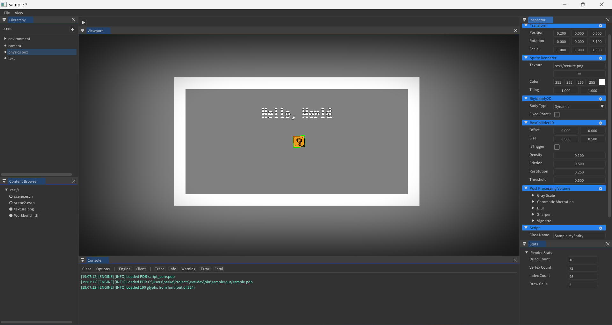

# EVE



A yet another cross platform game engine which is easy to use and performant.

## Features

- 2D Renderer
- Asset System
- C# Mono Scripting
- Post Processing
- 2D Physics
- (Coming Soon) Animations
- (Coming Soon) Particle System
- (Coming Soon) VFX
- (Coming Soon) Cinematics
- (Coming Soon) Audio
- (Coming Soon) Localization
- (Coming Soon) Networking
- (Coming Soon) Plugins
- (Coming Soon) 3D Renderer

## Modules

- [editor/](editor/README.md)
- [engine/](engine/README.md)
- [runtime/](runtime/README.md)
- [script_core/](script_core/README.md)
- [shaders/](shaders/README.md)

## Docs

- [Scripting Setup](docs/SCRIPTING_SETUP.md.md)

## Dependencies
- Windows 10+ or Linux operating system.
- [Python 3.11+](https://www.python.org/downloads/) for build script (not required but recommended).
- [Clang](https://github.com/llvm/llvm-project/releases/tag/llvmorg-17.0.1/) as C++ compiler.
- [CMake](https://cmake.org/download/) as build system.
- [Ninja](https://github.com/ninja-build/ninja/releases/) for building.
- [DotnetSDK](https://dotnet.microsoft.com/en-us/download/) for building C# scripting interop and projects.
- [VulkanSDK](https://vulkan.lunarg.com/sdk/home/) for shader compilcation.

## Building

In order to build the engine, you need to build the engine core with editor and the script_core ,which is the main c# api, for the scripting separately. But we have a script to handle those for us.

- First clone the github repository:
```bash
git clone --recursive https://github.com/gl1tchs/eve.git
```

- Then build the engine in desired configuration:
```bash
python build.py -config=MinSizeRel --all
```

You can get more information about the build.py script by:
```bash
python build.py --help
```
